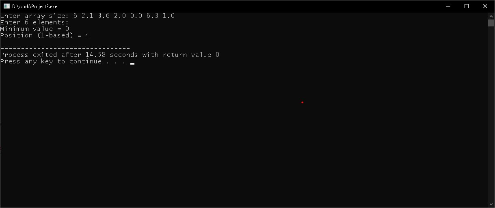
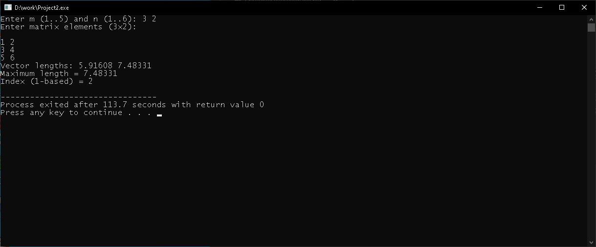

# Laboratory Work №3  

**Course:** Object-Oriented Programming  
**Topic:** One-dimensional arrays and matrices  
**Student:** Vivchar Vadym, group ALK-43  

## Task 1  
Code: [Task1/main.cpp](./Task1/main.cpp)  
Result:  
  

## Task 2  
Code: [Task2/main.cpp](./Task2/main.cpp)  
Result:  
  

## Control Questions  

1. **How is an array declared?**  
Answer: `type name[size];` (example: `int a[10];`).  

2. **What types of arrays are possible?**  
Answer: integer, floating-point, char, bool, structures, classes, pointers; one-dimensional and multidimensional.  

3. **What happens if fewer elements are specified during initialization?**  
Answer: the specified values are stored, the rest are filled with zeros (for basic types).  

4. **How to access an array element?**  
Answer: by index `a[i]`; or through a pointer `*(p+i)`.  

5. **How to copy one array into another?**  
Answer: with a loop, `std::copy()`, or assignment operator for `std::vector`.  

6. **How to describe an array of pointers?**  
Answer: `type *name[size];` (example: `int *p[5];`).  

7. **What is dereferencing for?**  
Answer: to get the value stored at the address a pointer refers to (`*p`).  

8. **How to input and output arrays?**  
Answer: with a loop using `cin >> a[i];` / `cout << a[i];`, or with iterators.  

9. **What are the known format specifiers (C++ iostream)?**  
Answer: `fixed`, `scientific`, `setprecision`, `setw`, `setfill`, `left`, `right`, `hex`, `oct`, `dec`, `showpos`.  

